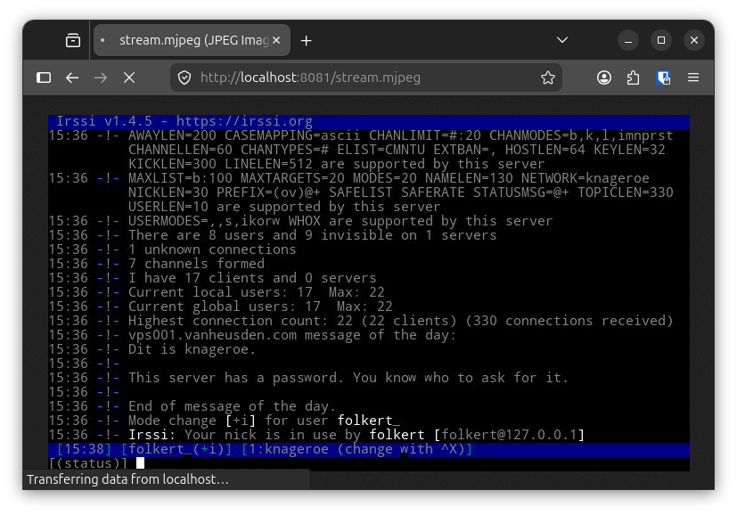
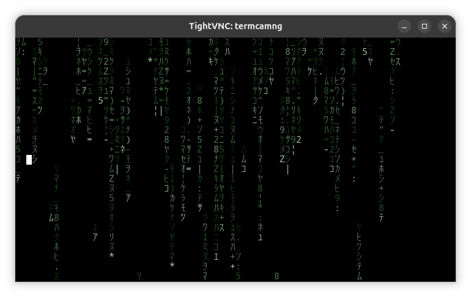
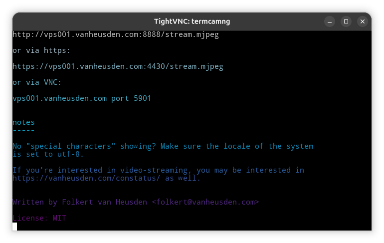
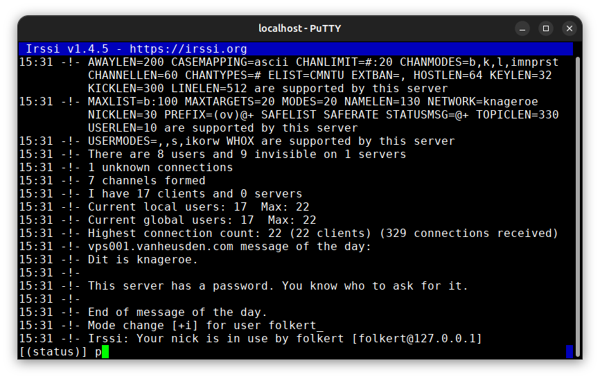

what it is
----------

This program runs an other program in an emulated ANSI/xterm terminal.
The terminal is rendered to a video stream like PNG, MJPEG or VNC. The
PNG/MJPEG/JPEG/etc is served via an internal webserver. The VNC server
is also integrated.
You can connect to it using an SSH, telnet or vnc client and then
interact with the program that is running.
The internal SSH server authenticats via PAM against the local user-
database of the Linux system.

required
--------

 * libpam0g-dev
 * libpng-dev
 * libssh-dev
 * libyaml-cpp-dev
 * libturbojpeg0-dev
 * libfreetype-dev
 * libwolfssl-dev
 * libfontconfig-dev

suggested
---------

 * fonts-noto-mono
 * fonts-noto-color-emoji
 * fonts-wine
 * fonts-unifont

creating
--------

 * mkdir build
 * cd build
 * cmake ..
 * make

running
-------

Run 'termcamng' with an optional path to a yaml-file containing the
configuration. See termcamng.yaml included for an example.

Note that you need to generate host-keys for the SSH functionality
to work (see "ssh-keygen -A").

http/https
----------

 * http://ip-adres/frame.png     <-- 1 PNG frame
 * http://ip-adres/stream.mpng   <-- stream of PNG images
 * http://ip-adres/frame.jpeg    <-- 1 JPEG frame
 * http://ip-adres/stream.mjpeg  <-- MJPEG stream
 * http://ip-adres/frame.bmp     <-- 1 BMP frame
 * http://ip-adres/stream.mbmp   <-- stream of BMP images
 * http://ip-adres/frame.tga     <-- 1 TGA frame
 * http://ip-adres/stream.mtga   <-- stream of TGA images

vlc
---

 * vncviewer ip-adres:5901

demo
----

http://vps001.vanheusden.com:8888/stream.mjpeg

or via https:

https://vps001.vanheusden.com:4430/stream.mjpeg

or via VNC:

vps001.vanheusden.com port 5901

notes
-----

No "special characters" showing? Make sure the locale of the system
is set to utf-8.

If you're interested in video-streaming, you may be interested in
https://vanheusden.com/constatus/ as well.

screenshots
-----------

Written by Folkert van Heusden <folkert@vanheusden.com>

License: MIT
